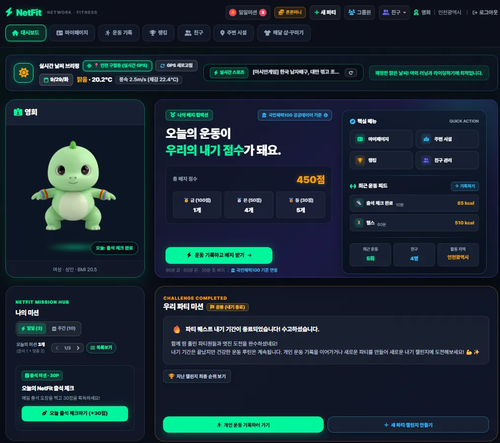
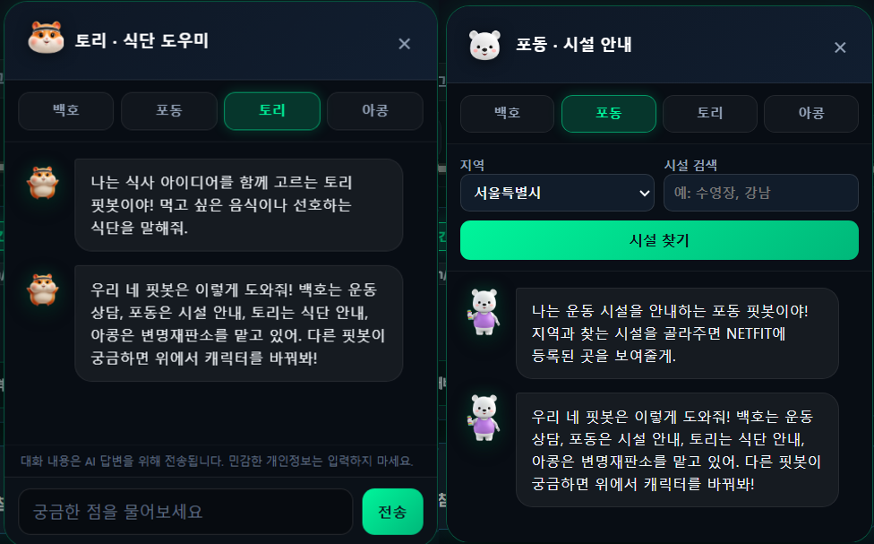
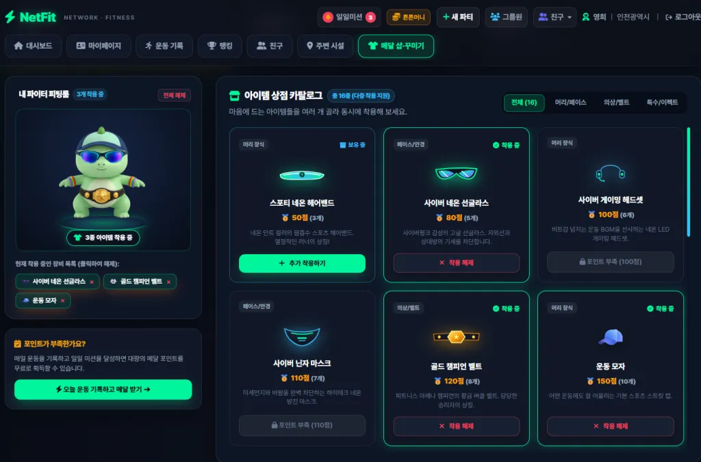
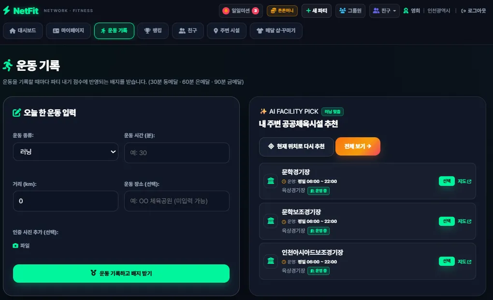

**2026 국민체육진흥공단 공공데이터 활용 경진대회**

서비스(웹/앱) 개발 부문 · 서비스 기획서

# NetFit 서비스 기획서

넷핏

캐릭터와 함께 성장하는 게임형 공공 피트니스 플랫폼

| **작성 기준일** | 2026년 9월 28일                         |
|-----------------|-----------------------------------------|
| **운영 주소**   | https://netfit-production.onrender.com/ |
| **저장소**      | https://github.com/pes9476/netfit       |
| **운영 브랜치** | runsv / 테스트 브랜치 testsv            |

## 목차

01 팀 소개

02 프로젝트 개요

03 기술 스택 · 아키텍처 · 폴더 구조

04 WBS (작업 분해 구조)

05 요구사항 명세서

06 ERD (데이터 구조)

07 주요 프로시저

08 수행결과 (테스트 / 시연)

09 한 줄 회고

10 제약사항 및 향후 개선

## 1. 팀 소개

### 1-1. 팀명

**\[넷핏\] (서비스명: NetFit)**

### 1-2. 팀 구성 및 GitHub 계정

| **이름**   | **역할**   | **주요 담당**                                                                                 | **GitHub**                    |
|------------|------------|-----------------------------------------------------------------------------------------------|-------------------------------|
| **장기욱** | 팀장       | Supabase·Django 연동, DB 마이그레이션, CI/CD·시설 ETL, Gemini 레이트 리밋, FitbotConversation | @GitJANG961013                |
| **박준범** | 백엔드     | 표시 개선, 캐릭터 렌더러 QA, runsv 통합·Render 배포, 시설 동기화, Groq+Gemini 이중화          | @juntigger / junbum8398-blip  |
| **박은서** | 프론트엔드 | 핏봇 Gemini 연동, 캐릭터 이름 통일, 아이템 z-index 렌더러, 대시보드(날씨·RSS·미션허브)        | @pes9476                      |
| **이어진** | 기획/협업  | 대시보드·핏봇 UI 설계, 팀 가이드 문서, 프롬프트 엔지니어링·테스트                             | @joblessking00 / jobless-fish |

공통 저장소: pes9476/netfi

## 2. 프로젝트 개요

### 2-1. 프로젝트명

NetFit(넷핏) — 캐릭터와 함께 성장하는 게임형 공공 피트니스 플랫폼

NetFit은 Network / Fitness의 합성어로, 사람과 사람 (친구·파티·지역주민), 사람과 공공체육(시설·스포츠복)을 연결하는 게이미피케이션 기반 플랫폼이다.

### 2-2. 프로젝트 소개

NetFit은 운동을 “혼자 하는 숙제”에서 “캐릭터를 키우고 친구와 함께하는 챌린지”로 바꿔 접근성을 낮추고 지속성을 부여하는 웹 서비스다.

사용자는 네개의 마스코트(백호·토리·아콩·포동) 중 하나를 골라 운동을 기록하고, 미션을 달성해 포인트로 캐릭터를 꾸민다. 친구와 파티를 맺어 운동 챌린지를 진행하고, 전국 공공체육시설 데이터를 바탕으로 지금 이용 가능한 주변 시설을 추천받는다. 마스코트를 활용한 AI 챗봇 ‘핏봇’은 각각 캐릭터에 부여한 카테고리에서대화형 안내와 도움을 제공하고 주변 시설을 안내한다.

*그림 1. 실시간 날씨·스포츠 뉴스·마스코트·파티 미션·주변 시설을 한눈에 보는 대시보드*

### 2-3. 프로젝트 배경

1.  운동은 시작보다 지속이 어렵다. 혼자 하는 운동은 동기 유지 장치가 약하다. 게임의 성장·보상·경쟁 요소는 반복 행동을 만드는 검증된 구조다.

2.  공공체육시설 정보가 흩어져 있다. 데이터는 공개돼 있지만 “지금, 내 근처에서, 원하는 종목으로” 쓰기 어렵다. 파일 제공이라 수집·정제·갱신 과정이 필요하다.

3.  튼튼머니 등 공공기관의 체육복지 정보의 접근성 체육복지 혜택을 함께 안내한다.

### 2-4. 프로젝트 목표

| **목표**                        | **구체적 산출물**                                             | **상태** |
|---------------------------------|---------------------------------------------------------------|----------|
| **운동 지속 동기 부여**         | 캐릭터, 개인·파티 미션, 메달 시스템, 1등 축하 연출            | ✅       |
| **공공데이터의 실사용화**       | 전국 공공체육시설 CSV 검증·동기화, 종목별 추천, 운영상태 표시 | ✅       |
| **지속 가능한 데이터 운영**     | 원본 ID 중복 방지, 폐업 비활성화, 동기화 기록, 일일 스케줄러  | ✅       |
| **접근성을 낮춘 대화형 AI챗봇** | 핏봇(Groq API 1차 + Gemini API 대체), 시설 검색 결합          | ✅       |
| **운영**                        | Render 배포, GitHub Actions, 무료 API 조합                    | ✅       |

### 2-5. 주요 기능

| **기능**              | **제공 가치**                                                  |
|-----------------------|----------------------------------------------------------------|
| **대시보드**          | 위치 기반 초단기 날씨, 스포츠 뉴스 롤링, 마스코트 카드 요약    |
| **프로필·마스코트**   | 백호·포동·토리·아콩 선택, 운동 기록으로 성장·꾸미기            |
| **파티 챌린지**       | 그룹 결성, 방장 퀘스트, 순위 뱃지, 1등 폭죽, 마감 시 운동 유도 |
| **위치기반 시설추천** | GPS 탐색, 장소검색, 운영시간·휴무 배지, 네이버 딥링크          |
| **AI 핏봇**           | 전역 위젯, Groq+Gemini 폴백, 시설 지리정보 결합 상담           |
| **랭킹·복지**         | 지역/친구 랭킹, 튼튼머니 인증시설 안내 팝업                    |

### 2-6. 활용 데이터

| **데이터명**               | **출처**                         | **활용**                     |
|----------------------------|----------------------------------|------------------------------|
| **전국 공공체육시설 현황** | 국민체육진흥공단(공공데이터포털) | 시설명·유형·좌표·운영상태    |
| **기상 실측 API**          | Open-Meteo · METAR               | 운량·강수·체감온도·실내외 팁 |
| **시설 지리정보**          | Supabase                         | 핏봇 RAG·주변 검색           |

## 3. 기술 스택 · 아키텍처

### 3-1. 기술 스택

| **구분**              | **기술**                              | **선택 이유**                                  |
|-----------------------|---------------------------------------|------------------------------------------------|
| **백엔드**            | Python 3.13, Django 5.x               | 프레임워크의 우수성                            |
| **프론트엔드**        | Django 템플릿, HTML5·CSS3·Vanilla JS  | 별도 빌드 없이 SSR + 필요한 곳만 fetch         |
| **캐릭터 출력**       | PNG + CSS                             | 3D 엔진 없이 좌표 유지로 착용                  |
| **데이터베이스**      | PostgreSQL(Supabase), SQLite          | 운영은 관리형 무료 DB, 개발은 설치 없는 SQLite |
| **데이터 파이프라인** | sync_facilities, DataSyncRun, Actions | 서버 상주 스케줄러 없이 CI로 정기 실행         |
| **AI**                | Groq(1차) + Gemini(2차)               | 한도·모델 중단에 대비한 이중화                 |
| **외부 데이터**       | 공공시설, Open-Meteo, 네이버, 카카오  | ·                                              |
| **배포**              | Render, Gunicorn, /healthz/           | runsv push 시 render가 감지 후 자동 배포       |
| **협업·품질**         | GitHub, Django·Node 테스트, CI        | 운영·테스트 분리, 회귀 테스트                  |

### 3-2. 시스템 아키텍처

| **계층**         | **구성**                          | **역할**                                            |
|------------------|-----------------------------------|-----------------------------------------------------|
| **화면**         | 대시보드 · 피팅룸 · 핏봇 위젯     | 요청·응답, GPS, 시설 및 기관 링크                   |
| **애플리케이션** | Django · Render                   | 인증, 운동 기록, 미션, 아이템                       |
| **데이터**       | PostgreSQL / SQLite               | 사용자·운동·파티·시설 조회·저장                     |
| **AI**           | Groq(1차) + Gemini(2차)           | 핏봇 : 질문·답변, 공공시설위치·이용안내, 운동도우미 |
| **외부**         | Open-Meteo · 카카오 · 네이버      | 날씨·로그인·지도                                    |
| **품질 · 배포**  | GitHub · Render · sync_facilities | 2way 브랜치로 안정성확보, 변경사항 감지후 배포      |

기능 브랜치 : testsv(검사·수정/백업) → runsv(운영/배포) 최종 테스트는 브라우저·단위 테스트로 확인한다.

Render 배포 : runsv브랜치에 업데이트가 생기면 감지후 자동배포

### 3-3. 구성 영역별 역할

| **영역**                | **역할**                                                  | **주요 모듈**                       |
|-------------------------|-----------------------------------------------------------|-------------------------------------|
| **화면 인터랙션**       | 반응형 대시보드, 비동기 갱신, 파티 타이머, 애니메이션효과 | templates/, netfit-theme.css        |
| **사용자·마스코트**     | 카카오·자체 로그인, BMI, 아웃핏 착용                      | models.py, kakao.py, views.py       |
| **파티·게이미피케이션** | 결성, 방장 미션, 스코어보드, 마감 전환                    | services.py, dashboard.html         |
| **시설 동기화**         | URL 크롤링, Soft Delete, 운영시간 판별                    | facility_sync.py, facility-sync.yml |
| **핏봇**                | 듀얼 엔진 폴백, 시설 RAG                                  | fitbot_api.py                       |
| **실시간 데이터**       | Open-Meteo, 스포츠 뉴스 티커                              | context_processors.py, services.py  |

## 4. WBS (작업 분해 구조)

제출용 기획서 단계 일정과 README 기능 작업 코드를 함께 수록한다.

### 4-1. 단계별 일정

| **단계**            | **기간**  | **주요 작업**                                  | **상태** |
|---------------------|-----------|------------------------------------------------|----------|
| **1. 기획**         | ~9/14     | 아이디어·흐름·공공데이터 선정                  | ✅       |
| **2. 기반 구축**    | 9/14~16   | Django, 테마·캐릭터·로그인, 온보딩·퀘스트·시설 | ✅       |
| **3. 대시보드**     | 9/17~18   | 날짜 뱃지, 미션 명칭, 뉴스 롤링, 타이머        | ✅       |
| **4. 파티·시설 UX** | 9/21~22   | 애니메이션, 시설 추천, 위치 모달, 반응형       | ✅       |
| **5. 품질·데이터**  | 9/22      | testsv CI, CSV 검증·동기화·실행 기록           | ✅       |
| **6. 핏봇·정리**    | 9/23      | Groq 위젯, Gemini 전환, 종료 파티 필터         | ✅       |
| **7. 통합**         | 9/23      | runsv 병합, 마이그레이션 0024, 가이드          | ✅       |
| **8. 안정화**       | 9/24~26   | Groq-Gemini 대체, METAR, 번역기 차단           | ✅       |
| **9. 최종 고도화**  | 9/28      | 날씨 개편, 미션 허브, 일일 크론, 네이버        | ✅       |
| **10. 캐릭터·배포** | 9/28      | 공통 렌더러, 테스트, Render 25770ab            | ✅       |
| **11. 통합 검증**   | 9/28      | runsv 재병합, 테스트                           | ✅       |
| **12. 제출 준비**   | 9/29~10/2 | 운영 검증, 기획서·발표·시연 영상               | ✅       |

### 4-2. 기능 작업 코드

| **코드**      | **항목**                   | **담당** | **상태** |
|---------------|----------------------------|----------|----------|
| **INIT-01**   | Django 뼈대·기본 모델      | 팀공동   | ✅       |
| **AUTH-01**   | 카카오 소셜 로그인         | 팀공동   | ✅       |
| **DASH-01**   | 대시보드·뉴스 티커         | 팀공동   | ✅       |
| **CHAR-01**   | 4대 마스코트·신체정보      | 팀공동   | ✅       |
| **PARTY-01**  | 파티 내기·스코어보드       | 팀공동   | ✅       |
| **FAC-01**    | 시설 비동기 추천·위치 모달 | 팀공동   | ✅       |
| **INFRA-01**  | Render 배포·환경변수       | 팀공동   | ✅       |
| **AI-BOT-01** | 핏봇 듀얼 엔진             | 팀공동   | ✅       |
| **WEATH-01**  | Open-Meteo 기상 개편       | 팀공동   | ✅       |
| **PARTY-02**  | 미션 허브·마감 전환        | 팀공동   | ✅       |
| **SYNC-01**   | 시설 동기화·Soft Delete    | 팀공동   | ✅       |
| **SYNC-02**   | 운영시간·휴무·네이버       | 팀공동   | ✅       |
| **OUTFIT-01** | 아웃핏 레이어 피팅         | 팀공동   | ✅       |

## 5. 요구사항 명세서

### 5-1. 기능 요구사항

| **ID**    | **요구사항**     | **상세**                               | **상태**    |
|-----------|------------------|----------------------------------------|-------------|
| **FR-01** | 회원가입·로그인  | Django 인증, 카카오 로그인, 온보딩     | ✅          |
| **FR-02** | 캐릭터 선택      | 백호·토리·아콩·포동, 전 화면 이름 통일 | ✅          |
| **FR-03** | 운동 기록        | 종목·시간·거리·장소, 타이머            | ✅          |
| **FR-04** | 종목별 시설 추천 | 위치기반 종목별 시설 추천              | ✅          |
| **FR-05** | 시설 운영상태    | 유형별 배지·운영시간·네이버 링크       | ✅          |
| **FR-06** | 개인 미션·배지   | 일일 미션, 배지, 메달·포인트           | ✅          |
| **FR-07** | 파티 챌린지      | 생성·방장 미션·순위 칩·1등 축하        | ✅          |
| **FR-08** | 파티 마감        | 종료 파티 숨김, 운동 유도 카드         | ✅          |
| **FR-09** | 캐릭터 꾸미기    | 16종 구매·장착·해제, 동시 착용         | ✅          |
| **FR-10** | AI 코치 핏봇     | 전역 위젯, Groq 실패 시 Gemini         | ✅          |
| **FR-11** | 실시간 날씨      | GPS 강수·운량·체감온도, 실내외 팁      | ✅          |
| **FR-12** | 스포츠 뉴스      | 롤링 티커, 원문 새 창                  | ✅          |
| **FR-13** | 튼튼머니 안내    | 독립 팝업, 주변 인증 시설              | ✅          |
| **FR-14** | 시설 동기화      | CSV 검증, 원본 ID, 폐업 비활성         | ✅ 44,612행 |
| **FR-15** | 시설 갱신        | 다운로드 URL + Actions 일일 예약       | 🟡          |

### 5-2. 비기능 요구사항

| **ID**     | **요구사항**  | **구현**                                                    |
|------------|---------------|-------------------------------------------------------------|
| **NFR-01** | 비용          | Render, Supabase, Actions, Groq/Gemini/Open-Meteo 무료 티어 |
| **NFR-02** | 데이터 무결성 | 물리 삭제 금지, 기록 참조 보존, 원본 ID 중복 방지           |
| **NFR-03** | 가용성        | AI 이중화, /healthz/ 상태 확인                              |
| **NFR-04** | 보안          | API 키 환경변수, .env gitignore, Secret Scanning            |
| **NFR-05** | 사용성        | 모바일 반응형, 입력값 보존, 자동 번역 차단                  |
| **NFR-06** | 품질          | runsv/testsv 분리, CI, 회귀 테스트                          |

## 6. ERD (데이터 구조)

작업보고서·커밋 기준 재구성. 제출 전 fitness/models.py와 대조한다.

### 6-1. 엔터티 관계

- AUTH_USER 1:1 PROFILE

- AUTH_USER 1:N WORKOUT_RECORD / ITEM_PURCHASE / USER_BADGE / PARTY_MEMBER / QUEST

- PARTY 1:N PARTY_MEMBER / QUEST(방장 미션)

- ITEM 1:N ITEM_PURCHASE · BADGE 1:N USER_BADGE

- FACILITY 1:N WORKOUT_RECORD · DATA_SYNC_RUN N:1 FACILITY

### 6-2. 주요 엔터티

| **엔터티**             | **핵심 키**         | **주요 필드**                                             |
|------------------------|---------------------|-----------------------------------------------------------|
| **AUTH_USER**          | id PK               | username, password_hash                                   |
| **PROFILE**            | user_id FK          | character, points, equipped_items, onboarding_done        |
| **WORKOUT_RECORD**     | id PK               | sport, duration_min, distance_km, place, created_at       |
| **FACILITY**           | id / source_id UK   | name, type, sido, sigungu, lat, lng, is_active            |
| **DATA_SYNC_RUN**      | id PK               | started_at, created/updated/deactivated/failed, status    |
| **PARTY**              | id PK               | name, sport, target_minutes, stake, deadline_dt, owner_id |
| **PARTY_MEMBER**       | party_id + user_id  | score                                                     |
| **QUEST**              | id PK               | scope, title, completed                                   |
| **ITEM**               | code PK (16종)      | slot, price                                               |
| **ITEM_PURCHASE**      | user_id + item_code | 구매 이력                                                 |
| **BADGE / USER_BADGE** | id / user+badge     | 배지 마스터 및 획득 이력                                  |

### 6-3. 데이터 활용 원칙

- 지속 가능성: 정적 파일에 의존하지 않고 공공데이터포털 최신 다운로드 URL을 크롤링해 갱신한다.

- Soft Delete: DEL_AT=물리 삭제하지 않고 is_active=False로 비활성화하여 운동 기록 FK를 보존한다.

- 편의: 매일 04시 데이터점검 스케줄링으로 요일·시간대를 영업 중/상시 개방/휴무 등의 정보제공.

## 7. 주요 프로시저

### P-1. 공공체육시설 동기화 (sync_facilities)

4.  CSV 확보 — 저장 파일 또는 다운로드 URL

5.  행 검증 — 필수 컬럼·좌표 형식, 오류 행 기록

6.  source_id 기준 생성/변경분 갱신

7.  DEL_AT='Y' → is_active=False (물리 삭제 없음)

8.  건수를 DataSyncRun에 기록

9.  GitHub Actions가 매일 04:00(KST) 실행 (현재 facility-sync.yml은 testsv 기준, 운영 검증 추가 필요)

### P-2. 핏봇 응답

질문 → 라우터 → 시설 검색 결합 → Groq 1차 → 실패 시 Gemini → 둘 다 실패하면 원인 안내

*그림 2. 핏봇 플로팅 런처*

*그림 3. 전역 AI 코치 핏봇 대화 화면*

### P-3. 시설 운영상태 판별

| **시설 유형**      | **판별 규칙**                           |
|--------------------|-----------------------------------------|
| **야외 공원·트랙** | 상시 개방                               |
| **학교**           | 평일 수업 중 / 17시 이후·주말 개방      |
| **실내 공공시설**  | 평일 06~22시, 주말 09~18시, 월요일 휴무 |

### P-4. 파티 마감 처리

조회 시 deadline_dt \< now 비교. 종료 시 목록에서 제외하고 “기간 종료” 카드로 전환.

*그림 4. 파티 챌린지·순위 화면*

### P-5. 캐릭터 아이템 렌더링

장착 코드 → 고정 레이어 정렬 → 부위별 스프라이트 표시 → 캐릭터와 장비를 한 그룹으로 움직임 적용.

*그림 5. 마스코트 아웃핏 샵 · 16종 착용*

### P-6. 실시간 날씨

GPS → Open-Meteo(강수·운량·체감온도) → 비/흐림/맑음 → 실내·야외 팁 → 날씨 카드

### P-7. 운동 기록과 시설 추천

종목 선택 시 입력값을 보존한 채 주변 시설을 비동기로 추천한다.

*그림 6. 운동 기록과 종목별 주변 시설 추천*

## 8. 수행결과 (테스트 / 시연)

### 8-1. 시연 페이지

운영 서비스 https://netfit-production.onrender.com/

권장 시연 순서: 로그인 → 대시보드 → 운동 기록(시설 추천) → 핏봇 → 피팅룸 → 파티 마감

### 8-2. 테스트 결과

| **항목**          | **방법**                    | **결과** |
|-------------------|-----------------------------|----------|
| **운영 배포**     | Render 커밋 25770ab         | ✅       |
| **서버 상태**     | GET /healthz/               | ✅       |
| **정적 자산**     | 착용 JS · 이미지            | ✅       |
| **아이템 렌더러** | node --test outfit renderer | ✅       |
| **시설 동기화**   | 로컬 SQLite 재실행          | ✅       |
| **종료 파티**     | Django 회귀 테스트          | ✅       |
| **통합 테스트**   | runsv 병합                  | ✅       |

## 9. 한 줄 회고

| **이름**   | **회고**                                                                                                                 |
|------------|--------------------------------------------------------------------------------------------------------------------------|
| **박준범** | 대시보드·AI 핏봇·시설 추천 구현, 복합 API 통합. 복잡한 기술보다 실제 불편을 정확히 찾아 해결하는 것의 중요성을 배움.     |
| **박은서** | 화면 일관성 개선(캐릭터·파티·아이템)으로 완성도 향상. 기능 간 연결과 조합 검증에서 사용자 경험의 중요성을 배움.          |
| **장기욱** | Supabase·Django 연결, CI/CD·ETL 설계. 자동화 제약 속에서 데이터 일관성과 운영 추적 구조의 중요성을 배움.                 |
| **이어진** | 팀 가이드·설계·프롬프트 문서로 협업 구조 마련. 명확한 소통과 문서화가 4인 팀의 일관성과 효율성을 유지하는 핵심임을 배움. |

## 10. 제약사항 및 향후 개선

- 무료 티어(Render·Groq·Gemini) 한도에 따른 응답 지연·콜드스타트가 발생할 수 있다.

- 위치 권한 거부 시 시설·날씨 정확도가 떨어지므로 기본 지역 폴백을 강화할 수 있다.

- 향후: 네이티브 앱, 더 정밀한 시설 운영시간 원천 데이터, 랭킹·카드 배틀 고도화.

— 끝 —
